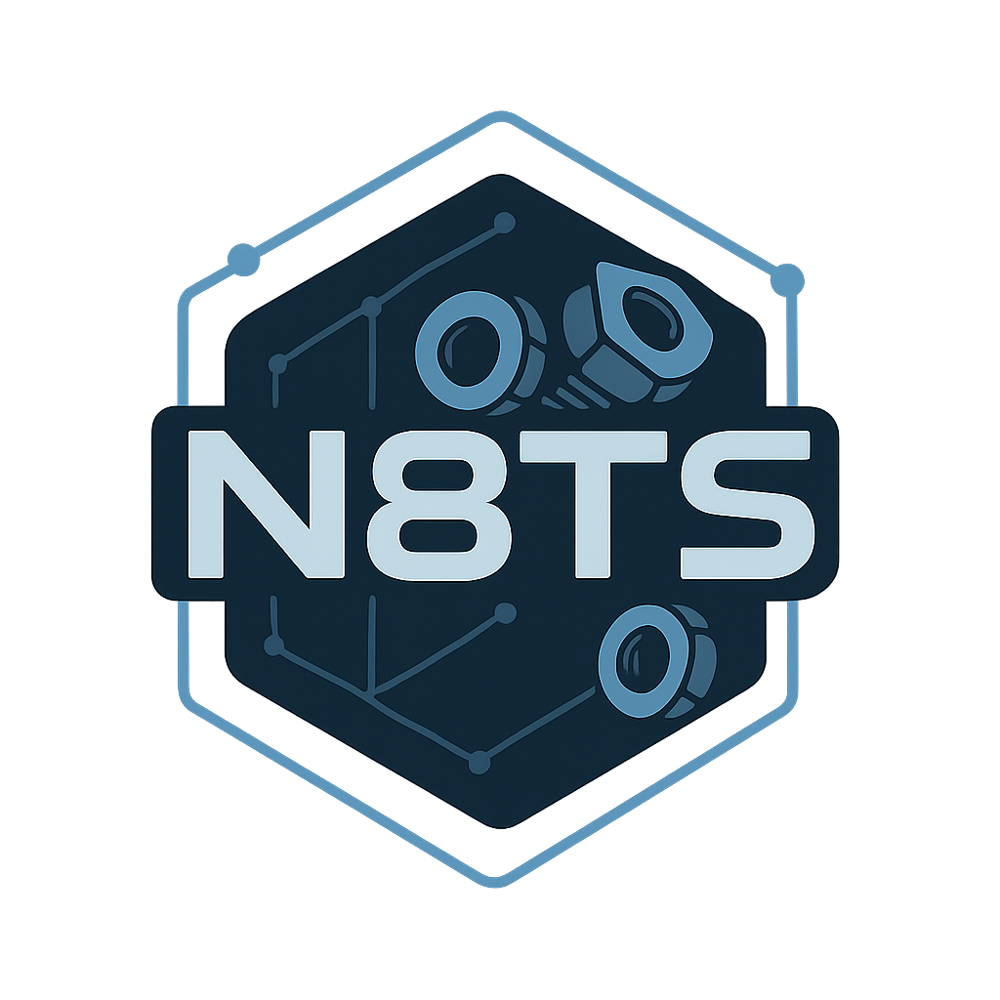

<p align="center">
  
</p>
<p align="center">
  <sup><sub>(see <a href="#logo-attribution">Logo Attribution</a> below)</sub></sup>
</p>

# nats-k8s-based-resolver - NATS Account Resolver

NATS based account resolver Kubernetes-native operator.

This operator provides a Kubernetes-native way to manage NATS accounts and users, allowing you to create and manage NATS accounts and users using Kubernetes Custom Resource Definitions (CRDs).

[](https://github.com/zerbytes/nats-k8s-based-resolver/pkgs/container/nats-k8s-based-resolver)
[](https://goreportcard.com/report/github.com/zerbytes/nats-k8s-based-resolver)
[](LICENSE)
[](https://github.com/zerbytes/nats-k8s-based-resolver/actions)

## Usage

> **Note**: This project is in early development stages, expect breaking changes and limited features.
> The API is not stable yet.

1. **Deploy the operator** - provides CRDs, generates Operator JWT and `$SYS` account automatically.
2. **Patch / deploy your NATS cluster** - mount and configure the following secrets:
    * `nats-operator-jwt` secret (operator.jwt)
    * `nats-sys-account-jwt` secret (sys.jwt)
    and enable `resolver: FULL` in `nats.conf`.
3. **Deploy the resolver service** (included YAML) - point it at NATS via env `NATS_URL` + mount the `$SYS` resolver creds.
4. **Create an account & user** (these are examples, you can use your own CRDs):
    * `NatsAccount` - defines a NATS account with JetStream enabled and permissions.
    * `NatsUser` - defines a user for the account with specific permissions.

```yaml
apiVersion: natsresolver.zerbytes.net/v1alpha1
kind: NatsAccount
metadata:
  name: payments
spec:
  jetStreamEnabled: true
  limits:
    maxConnections: -1 # -1 means no limit
    maxSubs: -1 # -1 means no limit
    maxData: -1 # -1 means no limit
    maxPayload: 1048576 # 1MB
    maxDiskStorage: -1 # -1 means no limit
    maxMemoryStorage: -1 # -1 means no limit
  permissions:
    # These permissions give full access.
    # You can restrict them to specific subjects if needed.
    publish:
      allow:
        - ">"
    subscribe:
      allow:
        - ">"
        - "_INBOX.>"
    #response:
    #  maxMsgs: 1000 # Optional, max number of response messages
    #  expires: "1h" # Optional, TTL for response messages
    # Optional, if you want to limit the number of messages and their TTL
    responseLimits:
      maxMsgs: 1000
      expires: "1h"
  # Expiration RFC3339 time - optional, infinite if omitted.
  #expiration: "2024-12-31T23:59:59Z"
---
apiVersion: natsresolver.zerbytes.net/v1alpha1
kind: NatsUser
metadata:
  name: payments-api
spec:
  accountRef:
    name: payments
    namespace: default
  # Expiration RFC3339 time - optional, infinite if omitted.
  #expiration: "2024-12-31T23:59:59Z"
  limits:
    maxPayload: 1048576 # 1MB
    maxSubs: -1 # -1 means no limit
    maxData: -1 # -1 means no limit
  permissions:
    # These permissions give full access.
    # You can restrict them to specific subjects if needed.
    publish:
      allow:
        - ">"
    subscribe:
      allow:
        - ">"
        - "_INBOX.>"
```

5. Mount `nats-user-payments-api-jwt` secret into your app pod and connect to NATS with the creds.

### Configure NATS To Use The Generated Secrets

To configure your NATS server to use the generated secrets, you need to modify your `nats.conf` file to include the following:

```conf
# nats.conf

# Make sure JetStream is enabled in your NATS config, if you want to use JetStream.
# Configuring JetStream docs: https://docs.nats.io/running-a-nats-service/configuration/resource_management
jetstream: enabled

# Operator JWT generated by the operator
operator: /etc/nkeys/operator/operator.jwt # <== mount Secret here

# The public key of the $SYS account (also in the Secret below)
system_account: ... # $SYS_ACCOUNT_PK

# This is the resolver configuration for NATS based account resolver
resolver: {
    type: full
    # Directory in which account jwt will be stored (in Kubernetes this can be a volume mount or emptyDir)
    dir: './jwt'
    # In order to support jwt deletion, set to true.
    # If you set it to true, it is recommend to set `hard_delete: true` as well.
    allow_delete: false
    #hard_delete: true
    # Interval at which a nats-server with a nats based account resolver will compare
    # it's state with one random nats based account resolver in the cluster and if needed,
    # exchange jwt and converge on the same set of jwt.
    interval: "2m"
    # Timeout for the resolver to wait for a response from the NATS server.
    timeout: "3s"
    # (optional) limit on the number of jwt stored, will reject new jwt once limit is hit.
    limit: 1000
}

# It is recommended to add the $SYS account JWT and public key to the preloader list
# The variables must be replaced with the actual values from the generated Secret.
resolver_preload: {
  $SYS_ACCOUNT_PK: $SYS_ACCOUNT_JWT # Public key and JWT of the $SYS account
}
```

(Taken from [NATS docs - Account lookup using Resolver - NATS Based Resolver](https://docs.nats.io/running-a-nats-service/configuration/securing_nats/auth_intro/jwt/resolver#full))

#### Using With NATS Helm Chart

If you are using the [NATS Helm Chart](https://github.com/nats-io/k8s), you can enable the resolver by adding the following to your `values.yaml`:

```yaml
# values.yaml
config:
  # [...]
  merge:
    max_payload: 3145728 # user tracker can create big updates at the moment
    # JWT / Operator / System-account settings
    # Pass the operator- and $SYS-account JWTs (generated by the operator)
    operator: /etc/nkeys/operator/jwt
    system_account: << $SYS_ACCOUNT_PK >>

    # Tell the server to use FULL resolver mode
    resolver:
      type: full
      # Directory in which account jwt will be stored (in Kubernetes this can be a volume mount or emptyDir)
      dir: '/cache/jwt'
      # In order to support jwt deletion, set to true.
      # If you set it to true, it is recommend to set `hard_delete: true` as well.
      allow_delete: false
      #hard_delete: true
      # Interval at which a nats-server with a nats based account resolver will compare
      # it's state with one random nats based account resolver in the cluster and if needed,
      # exchange jwt and converge on the same set of jwt.
      interval: "2m"
      # Timeout for the resolver to wait for a response from the NATS server.
      timeout: "3s"
      # (optional) limit on the number of jwt stored, will reject new jwt once limit is hit.
      limit: 1000
    
    resolver_preload: {
      # Public key and JWT of the $SYS account
      $SYS_ACCOUNT_PK: << $SYS_ACCOUNT_JWT >>
}

# Extra volumes, mounts, and env so the server sees the Secrets
container:
  env:
    # $SYS-account JWT and public key for config as environment variables
    SYS_ACCOUNT_PK:
      valueFrom:
        secretKeyRef:
          name: nats-sys-account-jwt
          key:  pub          # (added below in the controller)
    SYS_ACCOUNT_JWT:
      valueFrom:
        secretKeyRef:
          name: nats-sys-account-jwt
          key:  jwt          # (added below in the controller)
  
  patch:
    # Mount the operator JWT secret
    - op: add
      path: /volumeMounts/-
      value:
        name: operator-jwt
        mountPath: /etc/nkeys/operator
        readOnly: true
    # JWT cache volume
    - op: add
      path: /volumeMounts/-
      value:
        name: jwt-cache
        mountPath: /cache/jwt
        readOnly: true

podTemplate:
  patch:
    # Operator + $SYS-account JWTs
    - op: add
      path: /spec/volumes/-
      value:
        name: operator-jwt
        secret:
          secretName: nats-operator-jwt
    - op: add
      path: /spec/volumes/-
      value:
        name: sys-account-jwt
        secret:
          secretName: nats-sys-account-jwt
    # JWT cache volume
    - op: add
      path: /spec/volumes/-
      value:
        name: jwt-cache
        emptyDir: {}
```

(Currently these instructions are not fully tested and might be incomplete, please open an issue if you encounter problems.)

## Contributing

Contributions are welcome! A contributing guide will be added soon.

## Development

Golang 1.25.1+ is required to build this project.

```bash
# clone repo & init
make generate      # kubebuilder & controller-gen output
make manifests     # CRDs
make docker-build  # build operator & resolver images
make docker-push   # push to your repo
```

## License

This project is licensed under the Apache License 2.0 - see the [LICENSE](LICENSE) file for details.

### Logo Attribution

> 💬 *To me, a project becomes real the moment it gets a logo.*

The project logo was generated using OpenAI's DALL·E via ChatGPT (GPT-4o). It is AI-generated and used under the terms of the [OpenAI Terms of Use](https://openai.com/policies/terms-of-use).

No copyright or trademark is claimed on the logo. If you believe it infringes on any rights or presents a conflict, please [open an issue](https://github.com/zerbytes/nats-k8s-based-resolver/issues) or contact us via email.

The logo is intended for illustrative purposes and is subject to the same license as this project unless otherwise stated.
